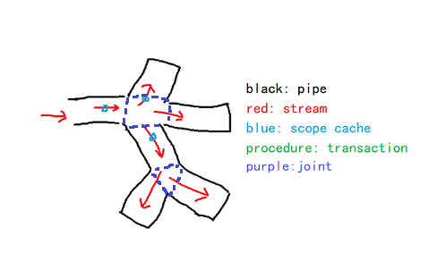

# Abstract
* a mini reactive framework for quickly building your program  
* some common qml and c++ components based on the rea for application  

# Solution
* solve the complex dependency relationship among codes in the complex application  
* eliminate the details of the threads, asynchronous, and other complex mechanism in the codes and make the codes more elegent by a graph  

# Rreference
* *stream program*  
* *reactive program*  
* *aspect oriented program*  
* *eventloop*  
* *promise*  

# Concept  
* pipe: a function wrapper which does something with some special logic  
* stream: a data wrapper which is transported in the pipes  
* scope cache: a cache data which based on some streams or all the streams  
* transaction: a procedure which denotes the start trig from one pipe and the ends of all its related activative pipes  

 

# Language
* *c++*  
* *qml*
* *js* (develop in the future)
* *python* (develop in the future)
* *java* (develop in the future)
* *delphi* (develop in the future)

# Repositories
[get code]()  